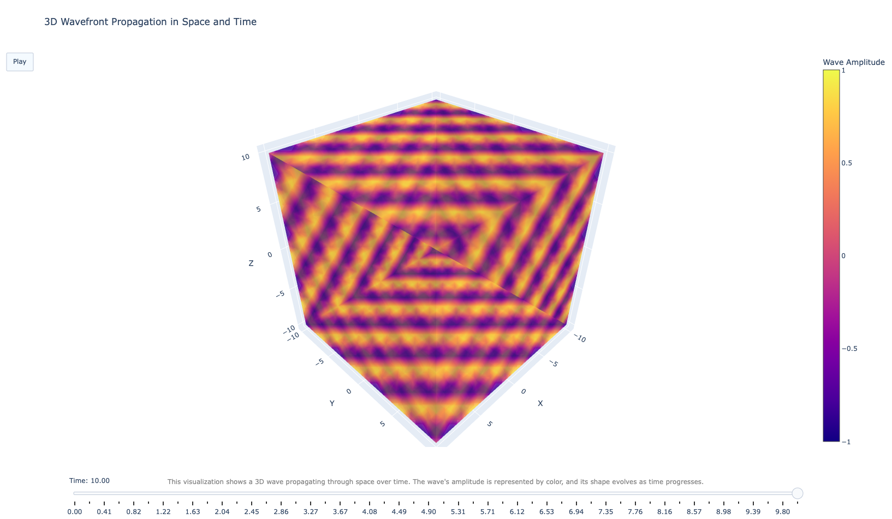

# **What This Visualization Represents**  

## **3D Wave Propagation in Space and Time**  

This animation visualizes a **propagating plane wave** in three-dimensional space. The wave follows the form of a **harmonic solution to the wave equation**, resembling oscillatory behavior found in acoustics, electromagnetism, and fluid dynamics.  

Imagine a ripple on water, but extended into **three dimensions**, evolving dynamically as time progresses. The animation captures the **changing wavefront** and how its amplitude varies in space.  

  

### **Key Features**  

**Wave Type:**  

- This is a **harmonic plane wave** moving through space, defined by the function:
  
$$
\large
\Psi(x, y, z, t) = \sin(k_x x + k_y y + k_z z - \omega t)
\large
$$

- This behavior is typical in **acoustic waves, electromagnetic waves, and other physical wave phenomena**.  

**Wave Vector and Wavenumber \( k \):**  

- The **wave vector** $$\mathbf{k} = (k_x, k_y, k_z)$$ determines the **direction** of wave propagation.  
- The **wavenumber** \( k \) represents the **spatial frequency** of the wave—how many oscillations fit into a given distance.  
- It's related to the wavelength by $$k = \frac{2\pi}{\lambda}$$, meaning a **larger** \( k \) results in **shorter wavelengths**.  

**3D Wave Structure:**  

- The wave exists in a **three-dimensional space**, defined by the **X, Y, and Z axes**.  
- **Isosurfaces** represent regions of constant wave amplitude, similar to contour lines on a topographic map but extended into 3D.  

**Time Evolution:**  

- Time acts as the **fourth dimension**, represented through animation.  
- Each frame corresponds to a **specific time step**, showing how the wavefront moves and deforms over time.  

This visualization offers an intuitive look at **wave behavior in 3D space**, making abstract wave mechanics more accessible and visually engaging.  
