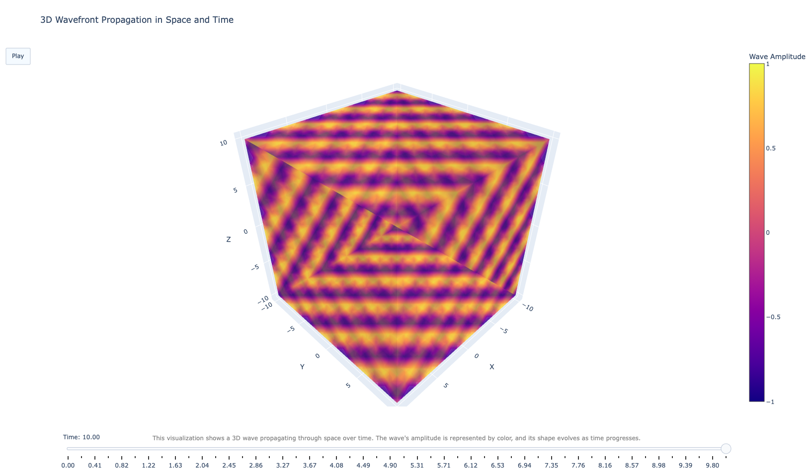

# What This Visualization Represents

## Work in Progress

### This animation shows a 3D wave propagating through space over time. Imagine a wave, like a ripple on the surface of water, but extended into three dimensions. The wave's shape and amplitude change as time progresses, creating a dynamic, evolving pattern

- 3D Space:
  - The wave exists in a three-dimensional space, represented by the XX, YY, and ZZ axes.
  - The isosurfaces show regions of constant wave amplitude, similar to contour lines on a map but extended into three dimensions.
  
- Time:
  - Time is the fourth dimension, represented by the animation. Each frame corresponds to a specific moment in time.
  - As time progresses, the wavefront moves and changes shape, creating a mesmerizing 3D pattern.